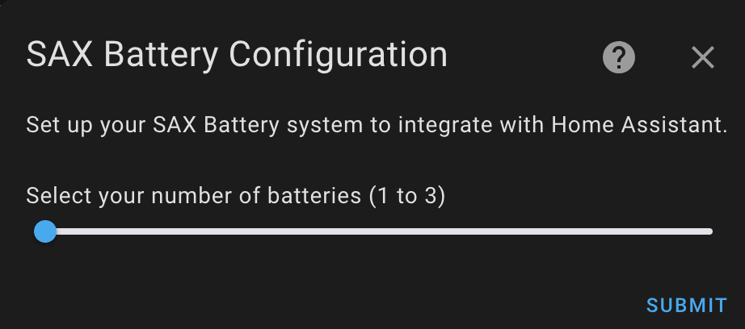
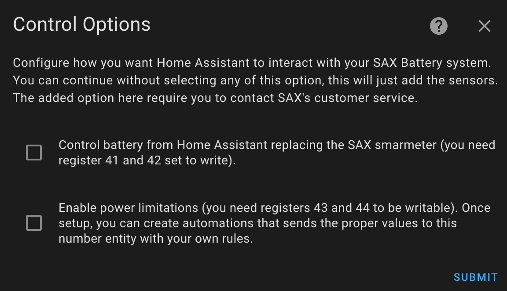
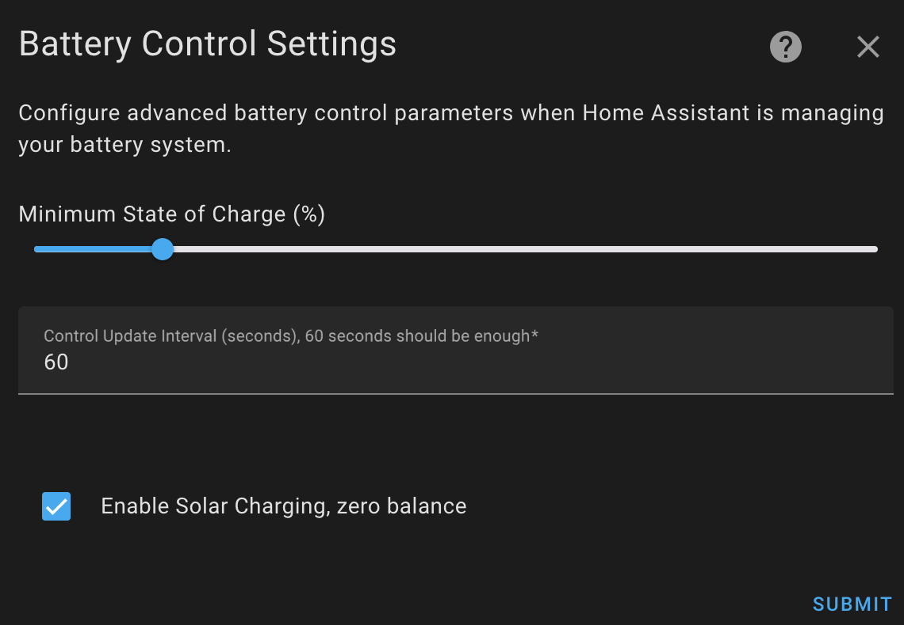
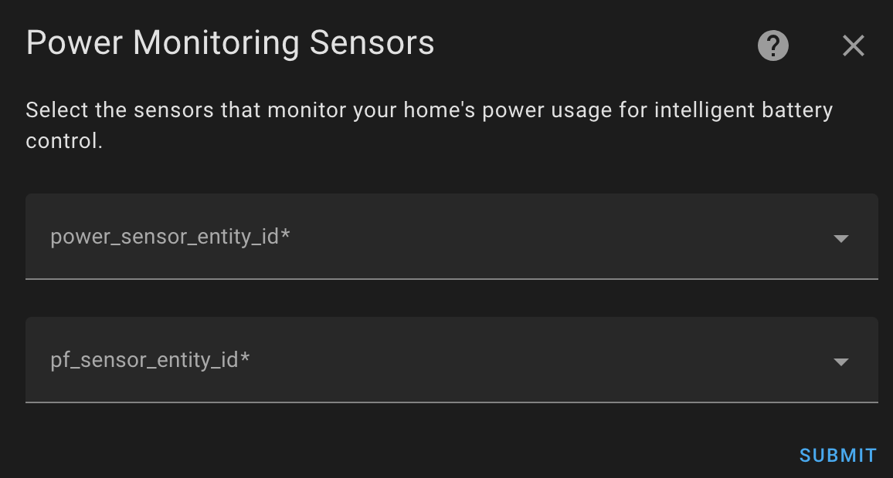
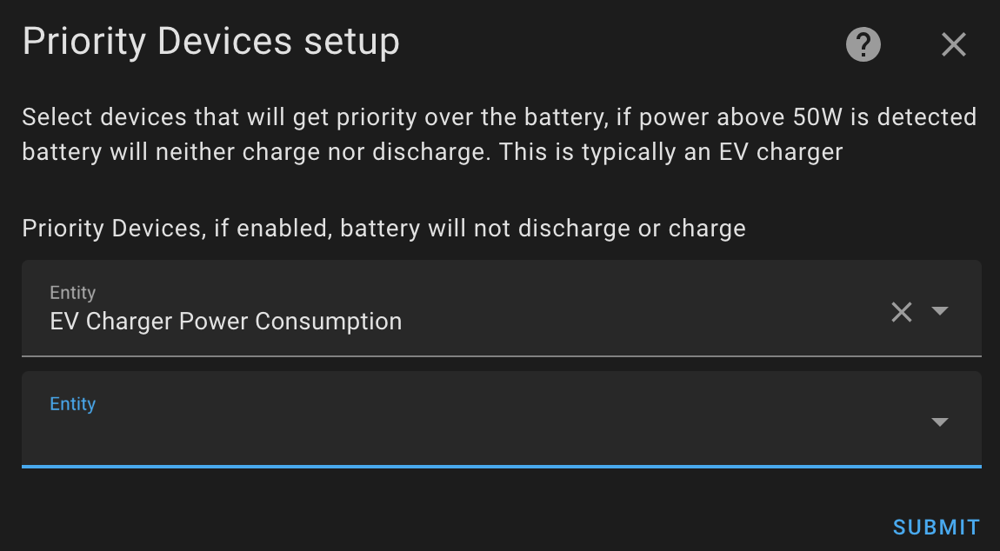
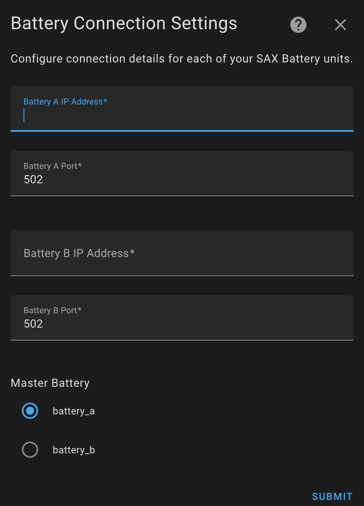
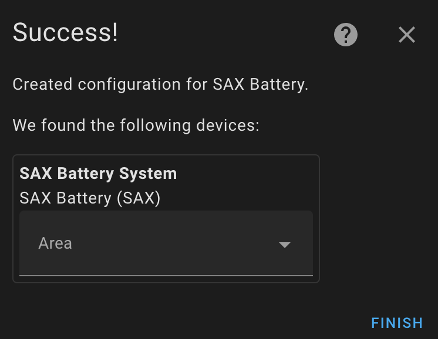
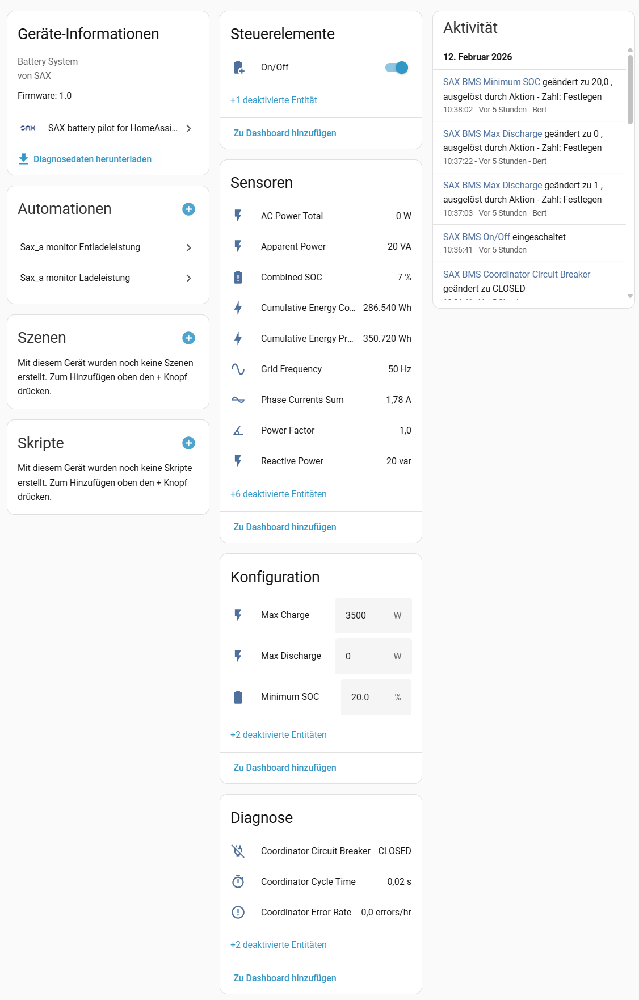
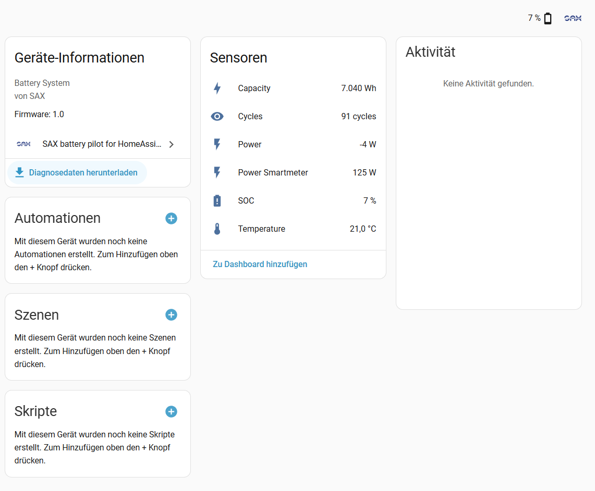
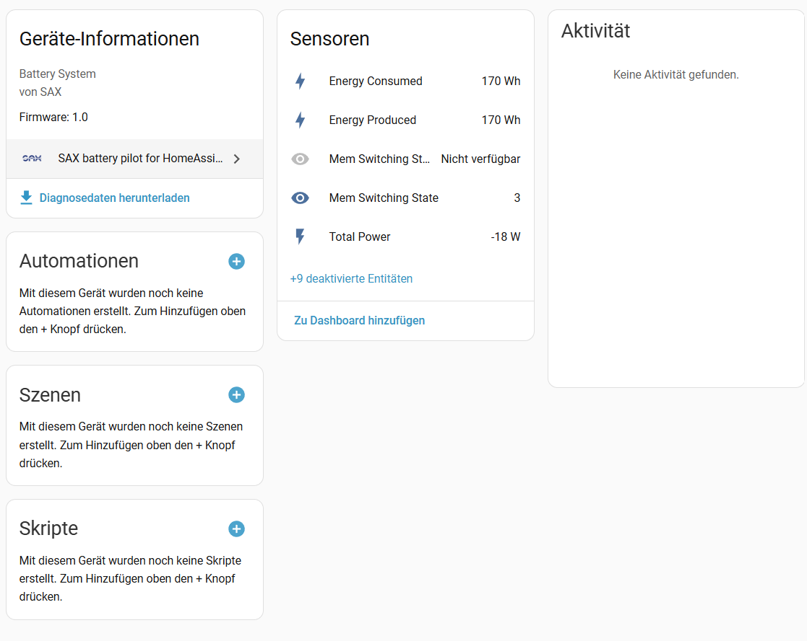

# Home Assistant integration for SAX-power batteries

[![GitHub Release][releases-shield]][releases]
[![HACS][hacs-shield]][hacs]
[![License][license-shield]](LICENSE)

A comprehensive Home Assistant custom integration for monitoring and controlling SAX-power energy storage systems. This integration provides real-time data collection, intelligent battery management, and automation capabilities for single or multi-battery installations across three-phase power systems.

## Key Features

- **Multi-Battery Support**: Manage up to 3 batteries with master/slave coordination across L1, L2, L3 phases
- **Real-Time Monitoring**: Track state of charge (SOC), voltage, current, temperature, and power metrics
- **Smart Power Management**: Automatic discharge limits based on minimum SOC thresholds
- **Solar Charging Control**: Enable/disable solar charging independently from grid operations
- **Priority Device Support**: Configure priority devices (EV chargers, heat pumps) to prevent battery discharge
- **Comprehensive Diagnostics**: Circuit breaker statistics, connection health, and firmware information
- **Local Communication**: All data stays on your local network via Modbus TCP/IP
- **Home Assistant Native**: Built following Home Assistant best practices with full UI configuration

> [!IMPORTANT]  
**Work in Progress**  
Battery management system (power control) is actively developed. Several configuration options are available depending on which registers you have write permission to access.

Refer to SAX-power portal documentation to learn how to enable write register permissions.

## Supported Devices

This integration supports SAX-power battery energy storage systems with:

- **Communication**: Modbus TCP/IP (Ethernet) and Modbus RTU (RS485)
- **Battery Models**: SAX-power BESS (Battery Energy Storage System)
- **Smart Meters**: SAX-compatible smart meters with RS485 connection
- **Firmware**: Tested with SAX Battery Management System (BMS) current firmware version

**Multi-Battery Configuration:**

- Battery A (L1): Master - handles smart meter polling and system coordination
- Battery B (L2): Slave - follows master instructions
- Battery C (L3): Slave - follows master instructions

## Supported Functions

### Monitoring (Read-Only)

- State of Charge (SOC) - individual and combined
- Battery voltage, current, and temperature
- Power flow (charge/discharge)
- Energy statistics (daily, monthly, lifetime)
- Grid power measurements (per phase and total)
- Smart meter data (voltage, current, frequency, power factor)
- Connection status and diagnostics

### Control (Requires Write Permissions)

- **Max Discharge Power**: Set maximum battery discharge limit (0-4600W per battery)
- **Max Charge Power**: Set maximum battery charge limit (0-3500W per battery)
- **Pilot Control**: Direct battery power control with automatic adjustments
- **Solar Charging**: Enable/disable solar charging independently
- **Manual Mode**: Override automatic controls for testing
- **Minimum SOC Protection**: Prevent deep discharge by enforcing minimum SOC thresholds

### Automation Features

- SOC-based discharge limiting
- Priority device detection and battery protection
- Time-based power management (via Home Assistant automations)
- Grid power monitoring and response

## Data Update Information

The integration uses efficient polling strategies optimized for multi-battery systems:

- **Master Battery (Phase L1)**:
  - Smart meter data: 15 seconds
  - Battery status: 30 seconds
- **Slave Batteries (Phases L2/L3)**:
  - Battery status: 30 seconds

**Performance Characteristics:**

- Non-blocking async communication
- Batched Modbus register reads
- Automatic retry with exponential backoff
- Circuit breaker protection (5 errors in 60 seconds triggers 5-minute pause)
- Local network only - no cloud dependencies

## Installation

### Via HACS (Recommended)

1. **Add Custom Repository**
   - Open HACS in Home Assistant
   - Go to `HACS > Integrations > ⋮ > Custom repositories`
   - Add repository URL: `https://github.com/matfroh/sax_battery_ha`
   - Select category: **Integration**
   - Click **Add**

2. **Install Integration**
   - Search for "SAX battery" in HACS
   - Click **Download**
   - Restart Home Assistant

### Manual Installation

1. **Download Files**
   - Download the latest release from [GitHub releases][releases]
   - Extract the `custom_components/sax_battery` folder

2. **Copy Files**
   - Copy the `sax_battery` folder to your Home Assistant `custom_components` directory
   - Path: `<config_dir>/custom_components/sax_battery/`

3. **Restart Home Assistant**
   - Restart Home Assistant to load the integration

## Configuration

### Prerequisites

Before configuring the integration, ensure:

- [ ] SAX Battery system is connected to your local network
- [ ] You know the IP address(es) of your battery/batteries
- [ ] Modbus TCP/IP communication is enabled on port 502 (default)
- [ ] (Optional) Write register permissions are enabled via SAX-power portal for control features

### Configuration Steps

1. **Add the Integration**
   - Navigate to **Settings** → **Devices & Services**
   - Click **+ Add Integration**
   - Search for **SAX battery**
   - Click to start configuration

2. **Select Number of Batteries**

   Choose how many batteries you want to configure (1–3).

   

3. **Select Control Options**

   Choose control features based on your write register permissions:
   - **Pilot from Home Assistant**: Direct power control (requires registers 43-44)
   - **Limit Power**: Set max charge/discharge limits (requires registers 41-42)

   

   > [!IMPORTANT]
   > Write registers must be enabled in SAX-power portal settings before these options work.

4. **Configure Protection Settings** *(if Pilot/Limit Power enabled)*

   Set battery protection parameters:
   - **Minimum SOC**: Prevents deep discharge (recommended: 15-20%)
   - **Auto Pilot Interval**: How often to recalculate power levels
   - **Solar Charging**: Enable/disable solar charging

   

   > [!WARNING]
   > **Battery Protection Critical**  
   > Configure minimum SOC threshold to prevent deep discharge (SOC 0%), which can damage your battery system. Recommended minimum: 15% (stops discharge at 10% with safety margin).

5. **Configure Grid Sensors** *(if power management enabled)*

   Select Home Assistant sensors for:
   - **Grid Power**: Total household power consumption
   - **Power Factor**: Grid power factor (optional, for accurate calculations)

   

6. **Configure Priority Devices** *(optional)*

   Select devices that should have priority over battery usage:
   - EV chargers
   - Heat pumps
   - Other high-priority loads

   When priority devices are active, the battery will not discharge to power them.

   

7. **Configure Battery Connection**

   For each battery, provide:
   - **IP Address**: Battery's local network IP
   - **Port**: Modbus TCP port (default: 502)
   - **Master Battery**: Select which battery is the master (if multiple)

   

8. **Complete Setup**

   Add location area and click **FINISH**.

   

### Post-Configuration

After configuration completes:

- Sensors should appear immediately with current values
- Enable additional entities (L2/L3 phases) in device settings if needed
- Entities become available within 30 seconds after enabling
- Clear browser cache or use private mode if upgrading from previous version

## Integration Overview

Once configured, the SAX Battery integration provides three main devices:

### SAX-power Integration


### SAX-BMS Device (Battery Management System)

Provides control entities for battery operation:

- Manual control switches
- Solar charging control
- Pilot power settings
- Maximum charge/discharge limits
- Configuration numbers (min SOC, pilot power)



### SAX-BESS Device (Battery Energy Storage System)

Monitors battery status and performance:

- State of Charge (SOC) - individual and combined
- Voltage, current, temperature per battery
- Power metrics (charge/discharge rates)
- Energy statistics (daily, monthly, lifetime)
- Battery health indicators



### SAX-Smartmeter Device

Tracks grid measurements:

- Grid power per phase (L1, L2, L3)
- Total grid power
- Voltage and current per phase
- Power factor and frequency
- Energy flow direction



> [!NOTE]
> By default, single-battery entities are enabled. For multi-battery setups, enable additional L2/L3 entities in device settings (available within 30 seconds).

## Use Cases

### 1. Solar Self-Consumption Optimization

**Scenario**: Maximize use of solar energy by charging battery during excess production and preventing grid export.

**Configuration**:

- Enable **Pilot from Home Assistant**
- Enable **Solar Charging**
- Set minimum SOC to 15-20%
- Configure grid power sensor

**Automation Example**:

```yaml
automation:
  - alias: "Battery: Charge from excess solar"
    trigger:
      - platform: numeric_state
        entity_id: sensor.grid_power
        below: -500  # 500W excess going to grid
    condition:
      - condition: numeric_state
        entity_id: sensor.sax_combined_soc
        below: 95  # Don't overcharge
    action:
      - service: number.set_value
        target:
          entity_id: number.sax_max_charge
        data:
          value: 3000  # Allow 3kW charging
```

### 2. Peak Shaving / Time-of-Use Optimization

**Scenario**: Reduce electricity costs by avoiding peak tariff periods using stored battery energy.

**Automation Example**:

```yaml
automation:
  - alias: "Battery: Discharge during peak hours"
    trigger:
      - platform: time
        at: "17:00:00"  # Peak tariff starts
    condition:
      - condition: numeric_state
        entity_id: sensor.sax_combined_soc
        above: 30  # Ensure sufficient charge
    action:
      - service: number.set_value
        target:
          entity_id: number.sax_max_discharge
        data:
          value: 3000  # Allow 3kW discharge
  
  - alias: "Battery: Stop discharge after peak"
    trigger:
      - platform: time
        at: "21:00:00"  # Peak tariff ends
    action:
      - service: number.set_value
        target:
          entity_id: number.sax_max_discharge
        data:
          value: 0  # Stop discharge
```

### 3. Backup Power Reserve

**Scenario**: Maintain minimum battery charge for emergency backup power.

**Configuration**:

- Set **Minimum SOC** to 30% or higher
- SOC manager automatically prevents discharge below threshold

**Notification Example**:

```yaml
automation:
  - alias: "Battery: Low SOC alert"
    trigger:
      - platform: numeric_state
        entity_id: sensor.sax_combined_soc
        below: 25
    action:
      - service: notify.mobile_app
        data:
          message: "Battery SOC below 25% - backup reserve declining"
          title: "Battery Warning"
```

### 4. EV Charging Protection

**Scenario**: Prevent battery from powering EV charging (use grid instead).

**Configuration**:

- Add EV charger to **Priority Devices** list during config flow
- Battery automatically stops discharging when EV charger is active

**Manual Override Example**:

```yaml
automation:
  - alias: "Battery: Disable discharge during EV charging"
    trigger:
      - platform: state
        entity_id: switch.ev_charger
        to: "on"
    action:
      - service: number.set_value
        target:
          entity_id: number.sax_max_discharge
        data:
          value: 0
```

### 5. Grid Outage Detection

**Scenario**: Monitor battery usage to detect potential grid outages.

**Automation Example**:

```yaml
automation:
  - alias: "Battery: Grid outage detection"
    trigger:
      - platform: numeric_state
        entity_id: sensor.sax_battery_power
        above: 2000
        for:
          minutes: 5
    condition:
      - condition: time
        after: "22:00:00"
        before: "06:00:00"
    action:
      - service: notify.mobile_app
        data:
          message: "Unusual battery discharge detected - possible grid outage"
```

## Known Limitations

### Hardware Limitations

- **Write-Only Registers**: Registers 41-44 (max charge/discharge, pilot control) cannot be read back from hardware
  - Integration caches values locally and restores them after restart
  - Initial UI state may show maximum values until integration updates
- **Smart Meter Polling**: Only master battery can poll smart meter data via RS485
- **Phase Imbalance**: Individual battery control limited - master coordinates all units
- **Modbus Transaction ID Bug**: Hardware sometimes returns incorrect transaction IDs with `write_registers` command

### Software Limitations

- **Manual Mode Override**: When manual control is enabled, automated SOC protections are disabled
- **Priority Device Detection**: Requires Home Assistant entities - cannot detect non-HA devices
- **No Dynamic Battery Discovery**: Battery count must be configured during setup
- **Restart Required**: Configuration changes require Home Assistant restart (deprecated config flow)

### Network Limitations

- **Local Network Only**: No remote access without VPN
- **Modbus TCP Timeout**: Long network delays (>10s) may cause connection failures
- **Single Connection**: Cannot share Modbus connection with other software
- **No TLS/SSL**: Modbus TCP communication is unencrypted (use trusted network only)

### Performance Considerations

- **Polling Overhead**: Multiple batteries increase network traffic (master: 5-10s, slaves: 30s)
- **Entity Count**: Large installations may show 100+ entities
- **Startup Time**: Initial data refresh may take 30-60 seconds for all entities
- **Database Growth**: Energy statistics accumulate over time (HA recorder manages retention)

## Troubleshooting

### Connection Issues

#### Problem: "Cannot connect to battery" error during setup

**Solutions**:

1. Verify battery IP address:

   ```bash
   ping <battery_ip>
   ```

2. Check Modbus TCP port (default 502):

   ```bash
   telnet <battery_ip> 502
   ```

3. Ensure firewall allows Modbus TCP (port 502)
4. Verify battery is on same network/VLAN as Home Assistant
5. Check if another application is using Modbus connection

#### Problem: Integration becomes unavailable after running for hours

**Symptoms**: Entities show "Unavailable", then recover after minutes

**Solutions**:

1. Check Home Assistant logs for Modbus timeout errors:

   ```
   Logger: custom_components.sax_battery
   ```

2. Verify network stability (check for packet loss):

   ```bash
   ping -t <battery_ip>
   ```

3. Enable circuit breaker diagnostics to see error rates
4. Reduce polling frequency if network is congested
5. Update to latest integration version (improvements in connection handling)

### Data Issues

#### Problem: SOC shows 0% or incorrect values

**Solutions**:

1. Wait 30-60 seconds for initial data refresh
2. Check if battery is in standby mode
3. Verify Modbus communication is working (check diagnostics)
4. Restart integration:
   - Settings → Devices & Services → SAX Battery → ⋮ → Reload

#### Problem: Max discharge/charge sliders show maximum values after restart

**Explanation**: Registers 41-42 are write-only; integration restores last known values

**Solutions**:

1. Wait for integration to restore values (happens automatically within 30s)
2. Check entity states in Developer Tools to see actual cached values
3. If values not restored, manually set desired limits again

### Control Issues

#### Problem: Power limits not working (battery ignores settings)

**Checklist**:

1. Verify write registers are enabled in SAX-power portal
2. Check minimum SOC protection isn't overriding limits
3. Ensure manual control mode is disabled (if not intended)
4. Check Home Assistant logs for write errors
5. Verify battery firmware supports remote control

#### Problem: SOC constraint keeps resetting max discharge to 0W

**Explanation**: SOC manager enforces minimum SOC threshold for battery protection

**Solutions**:

1. Check current SOC - if below minimum threshold, this is correct behavior
2. Adjust minimum SOC threshold if too aggressive:
   - Lower `number.sax_min_soc` value
3. Temporarily disable SOC manager (not recommended):

   ```yaml
   # In configuration.yaml (advanced users only)
   sax_battery:
     soc_enforcement: false
   ```

4. Charge battery above minimum threshold

### Configuration Issues

#### Problem: Priority devices not preventing battery discharge

**Checklist**:

1. Verify entities are correctly selected during config flow
2. Check if entities are available and updating
3. Ensure entity values are properly detected (>0W for power sensors, "on" for switches)
4. Check power manager diagnostics for device detection status
5. Review entity state history to confirm devices are active when expected

#### Problem: Multi-battery setup shows wrong phase assignment

**Solution**:

1. Verify master battery selection during configuration
2. Check battery IDs match physical phase connections:
   - Battery A → L1 (Master)
   - Battery B → L2 (Slave)
   - Battery C → L3 (Slave)
3. Reconfigure integration if incorrect

### Diagnostic Tools

#### Enable Debug Logging

Add to `configuration.yaml`:

```yaml
logger:
  default: info
  logs:
    custom_components.sax_battery: debug
    pymodbus: debug
```

Restart Home Assistant and check logs under **Settings → System → Logs**.

#### Check Integration Diagnostics

1. Navigate to **Settings → Devices & Services**
2. Find **SAX Battery** integration
3. Click **⋮ → Download diagnostics**
4. Share diagnostics when reporting issues (remove sensitive data first)

#### Monitor Circuit Breaker

Circuit breaker diagnostics show connection health:

- **Closed**: Normal operation
- **Open**: Too many errors, connection paused (5min cooldown)
- **Half-Open**: Testing connection recovery

### Getting Help

If troubleshooting doesn't resolve your issue:

1. **Search existing issues**: [GitHub Issues][issues]
2. **Create new issue**: Include:
   - Home Assistant version
   - Integration version
   - Battery model/firmware
   - Diagnostic download
   - Relevant log excerpt (debug mode)
   - Steps to reproduce
3. **Community forum**: [Home Assistant Community][community]

## Removal Instructions

### Remove Integration

1. **Remove Configuration Entry**
   - Navigate to **Settings → Devices & Services**
   - Find **SAX Battery** integration
   - Click **⋮ → Delete**
   - Confirm deletion

2. **Restart Home Assistant** (recommended)
   - Ensures all entities and devices are properly removed

### Uninstall Integration Files

#### Via HACS

1. Open **HACS → Integrations**
2. Find **SAX battery**
3. Click **⋮ → Remove**
4. Restart Home Assistant

#### Manual Uninstall

1. Delete folder: `<config_dir>/custom_components/sax_battery/`
2. Restart Home Assistant

### Clean Up (Optional)

If you want to remove all traces:

1. **Remove entity history** (optional):
   - Navigate to **Developer Tools → Statistics**
   - Search for `sax_`
   - Delete individual statistics if desired

2. **Clear cached data**:

   ```bash
   # SSH into Home Assistant
   rm -rf /config/.storage/core.entity_registry
   # Only affects entities, will be regenerated
   ```

> [!WARNING]
> Deleting entity registry removes ALL entity customizations (not just SAX Battery). Only do this if you're certain.

## Contributing

Contributions are welcome! Please:

1. Fork the repository
2. Create a feature branch
3. Follow code style guidelines (Ruff, MyPy)
4. Add tests for new features
5. Submit a pull request

See [CONTRIBUTING.md](CONTRIBUTING.md) for detailed guidelines.

## License

This project is licensed under the MIT License - see the [LICENSE](LICENSE) file for details.

## Credits

- **Developer**: [@matfroh](https://github.com/matfroh)
- **SAX-power**: [SAX Power GmbH](https://www.sax-power.com/)
- **Home Assistant**: [Home Assistant](https://www.home-assistant.io/)

## Support

- **Issues**: [GitHub Issues][issues]
- **Discussions**: [GitHub Discussions](https://github.com/matfroh/sax_battery_ha/discussions)
- **Community**: [Home Assistant Community][community]

---

**Star this repo** ⭐ if you find it useful!

[releases-shield]: https://img.shields.io/github/v/release/matfroh/sax_battery_ha?style=flat-square
[releases]: https://github.com/matfroh/sax_battery_ha/releases
[hacs-shield]: https://img.shields.io/badge/HACS-Custom-orange.svg?style=flat-square
[hacs]: https://github.com/hacs/integration
[license-shield]: https://img.shields.io/github/license/matfroh/sax_battery_ha?style=flat-square
[issues]: https://github.com/matfroh/sax_battery_ha/issues
[community]: https://community.home-assistant.io/
