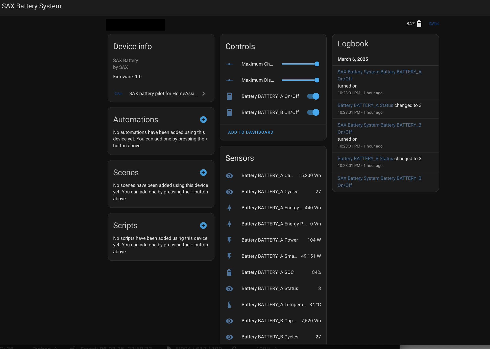

# Home Assistant AddOn to manage 1 or more SAX batteries

This is the initial version of a custom component for Home Assistant to manage one or multiple SAX batteries.
Work in progress for battery management, limiting discharge and charging levels as well as calculating the power to charge or discharge the battery, letting Home Assistant stear the battery.

## Installation:
Add the files to your /custom_components/ folder or use the "+" in the integrations tabs

1. Use [HACS](https://hacs.xyz/docs/setup/download), in `HACS > Integrations > Explore & Add Repositories` search for "sax battery". After adding this `https://github.com/matfroh/sax_battery_ha` as a custom repository, go to 7.
2. If you do not have HACS, use the tool of choice to open the directory (folder) for your HA configuration (where you find `configuration.yaml`).
3. If you do not have a `custom_components` directory (folder) there, you need to create it.
4. In the `custom_components` directory (folder) create a new folder called `sax_battery`.
5. Download the files from the `custom_components/sax_battery/` directory (folder) in this repository.
6. Place the files you downloaded in the new directory (folder) you created.
7. Restart Home Assistant.
8. Add the integration: [![Add Integration][add-integration-badge]][add-integration] or in the HA UI go to "Settings" -> "Devices & Services" then click "+" and search for "SAX battery".
9. Input the right parameter

Select the parameter you want to setup, stearing the battery with a selected entity to act as a smartmeter and/or select the feature to limit the power of charging or discharging of the battery. 
Both feature are work in progress.
Not selecting any feature will still install all the sensors of the battery.
After this stage, select the number of batteries your setup is made of and define the master battery. Enter IP and port of both batteries to read all sensors.
If you have multiple batteries, you could still only set the master battery and only read from this as well as stear it, but you will lack detailed sensors of the system.

Restart home assistant.

## Usage:
After restart, your sensors should immediately appear and give you current values

## How to test:

Power limiter to charge or discharge works but the device does not allow reading that value, so by default, slider is set to maximum and unless there is an error, the value passed is taken as working.
Please note that to stear the battery, limit power, you need to have the feature activated by the customer service of the battery manufacturer. A simple email can solve it. Please refer to the documentation.
Watch out: for battery stearing, setup all necessary protection to avoid deep discharge (bringing battery to SOC 0%) as this might damage your battery system. Recommendation is to start setting thresholds for discharge at 15% to avoid battery to go below 10%. 

---
[add-integration]: https://my.home-assistant.io/redirect/config_flow_start?domain=sax_battery
[add-integration-badge]: https://my.home-assistant.io/badges/config_flow_start.svg
