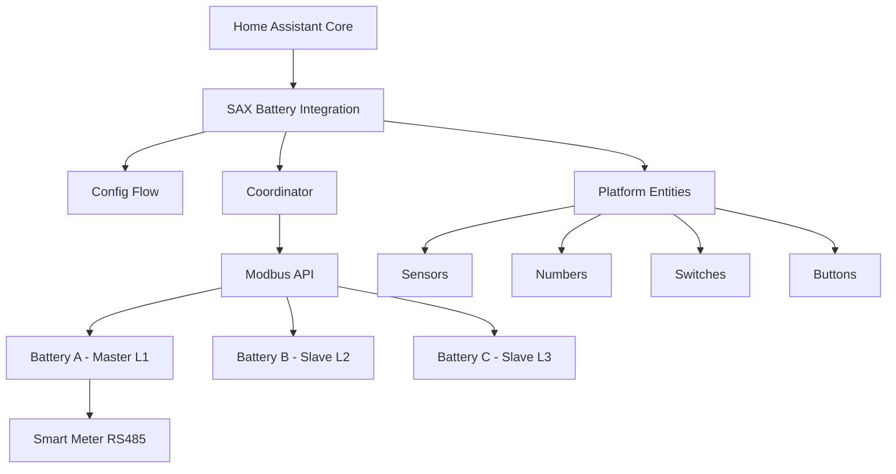

# SAX Battery Home Assistant Integration - Component Documentation

## Overview

The SAX Battery Home Assistant integration provides monitoring and control capabilities for SAX-power energy storage systems. This integration supports multi-battery configurations with master/slave coordination across three-phase power systems.

## Architecture

### System Components



### Communication Hierarchy

- **Master Battery (Phase L1)**: Handles smart meter polling, RS485 communication, system coordination
- **Slave Batteries (Phases L2/L3)**: Follow master instructions, individual monitoring
- **Polling Strategy**: Smart meter (5-10s), phase data (30-60s), battery data (standard)

## Core Components

### 1. Configuration Flow (`config_flow.py`)

**Purpose**: Handles integration setup and configuration management.

**Security Features**:

- Input validation for IP addresses and ports
- Timeout protection for network operations
- Secure credential handling

**Performance Optimizations**:

- Async network validation
- Connection pooling during setup
- Minimal blocking operations

```python
class SAXBatteryConfigFlow(ConfigFlow, domain=DOMAIN):
    """Handle SAX Battery config flow."""
    
    async def async_step_user(self, user_input: dict[str, Any] | None = None):
        """Handle user input step with security validation."""
        if user_input is not None:
            # Validate IP address format (security)
            try:
                ipaddress.ip_address(user_input[CONF_HOST])
            except ValueError:
                errors[CONF_HOST] = "invalid_host"
                
            # Test connection with timeout (performance)
            try:
                async with asyncio.timeout(10):
                    await self._test_connection(user_input)
            except (OSError, TimeoutError) as err:
                errors["base"] = "cannot_connect"
```

### 2. Data Coordinator (`coordinator.py`)

**Purpose**: Central data management and update coordination.

**Security Implementation**:

- Exception-specific error handling
- No sensitive data logging
- Secure connection management

**Performance Features**:

- Batched data updates
- Efficient polling intervals
- Memory-conscious data storage

```python
class SAXBatteryCoordinator(DataUpdateCoordinator):
    """SAX Battery data coordinator."""
    
    def __init__(
        self,
        hass: HomeAssistant,
        config_entry: ConfigEntry,
        sax_data: SAXData,
        modbus_api: ModbusAPI,
        battery_id: str,
    ) -> None:
        """Initialize coordinator with performance optimizations."""
        # Optimize polling based on battery role
        update_interval = (
            timedelta(seconds=5) if battery_id == "battery_a" 
            else timedelta(seconds=30)
        )
        
        super().__init__(
            hass,
            _LOGGER,
            name=DOMAIN,
            update_interval=update_interval,
        )
    
    async def _async_update_data(self) -> dict[str, Any]:
        """Update data with security and performance considerations."""
        try:
            # Batch smart meter and modbus updates for efficiency
            smart_meter_task = self._update_smart_meter_data({})
            modbus_task = self._update_modbus_data({})
            
            # Use gather for concurrent execution (performance)
            smart_data, modbus_data = await asyncio.gather(
                smart_meter_task, 
                modbus_task, 
                return_exceptions=True
            )
            
            # Merge data efficiently
            return {**smart_data, **modbus_data}
            
        except (ModbusException, OSError, TimeoutError) as err:
            # Specific exception handling (security)
            _LOGGER.error("Update failed: %s", err)
            raise ConfigEntryNotReady from err
```

### 3. Modbus Communication (`modbusobject.py`)

**Purpose**: Low-level Modbus TCP/IP communication with security and performance focus.

**Security Features**:

- Connection timeout protection
- Input validation for Modbus parameters
- Safe error handling without data exposure

**Performance Optimizations**:

- Connection pooling and reuse
- Efficient register reading strategies
- Minimal memory allocation

```python
class ModbusAPI:
    """Modbus API with security and performance optimizations."""
    
    def __init__(self, host: str, port: int) -> None:
        """Initialize with validated parameters."""
        # Validate host format (security)
        try:
            ipaddress.ip_address(host)
        except ValueError as err:
            raise ValueError("Invalid host address") from err
            
        self._host = host
        self._port = port
        self._client: AsyncModbusTcpClient | None = None
        self._lock = asyncio.Lock()  # Prevent concurrent access
    
    async def read_holding_registers(
        self, 
        address: int, 
        count: int = 1, 
        slave_id: int = 1
    ) -> int | None:
        """Read registers with performance and security considerations."""
        # Input validation (security)
        if not (0 <= address <= 65535):
            raise ValueError("Invalid Modbus address")
        if not (1 <= count <= 100):
            raise ValueError("Invalid register count")
            
        async with self._lock:  # Serialize access (performance)
            try:
                if not self._client or not self._client.connected:
                    await self._ensure_connection()
                
                # Use timeout for network operations (security)
                async with asyncio.timeout(5):
                    result = await self._client.read_holding_registers(
                        address, count, slave_id
                    )
                
                return result.registers[0] if not result.isError() else None
                
            except (OSError, TimeoutError) as err:
                _LOGGER.debug("Modbus read failed: %s", err)
                return None
```

### 4. Entity Platform Base (`entity_base.py`)

**Purpose**: Base class for all SAX Battery entities with consistent patterns.

**Security Implementation**:

- Secure unique ID generation
- Protected state attribute handling
- Safe device information exposure

**Performance Features**:

- Efficient state updates
- Minimal coordinator data access
- Optimized attribute generation

```python
class SAXBatteryEntityBase(CoordinatorEntity[SAXBatteryCoordinator]):
    """Base class for SAX Battery entities."""
    
    def __init__(
        self,
        coordinator: SAXBatteryCoordinator,
        battery_id: str,
        modbus_item: ModbusItem,
    ) -> None:
        """Initialize with security and performance considerations."""
        super().__init__(coordinator)
        self._battery_id = battery_id
        self._modbus_item = modbus_item
        
        # Generate secure unique ID (security requirement)
        self._attr_unique_id = f"sax_{battery_id}_{modbus_item.name}"
        
        # Set entity description efficiently (performance)
        if modbus_item.entitydescription:
            self.entity_description = modbus_item.entitydescription
    
    @property
    def extra_state_attributes(self) -> dict[str, Any]:
        """Return state attributes with performance optimization."""
        # Cache frequently accessed data
        if not hasattr(self, '_cached_attributes'):
            self._cached_attributes = {
                "battery_id": self._battery_id,
                "modbus_address": self._modbus_item.address,
                "entity_type": "modbus",
            }
        
        # Add dynamic data efficiently
        attributes = self._cached_attributes.copy()
        if raw_value := self.coordinator.data.get(self._modbus_item.name):
            attributes["raw_value"] = raw_value
        
        return attributes
```

## Platform Implementations

### Sensor Platform (`sensor.py`)

**Purpose**: Read-only monitoring entities for battery status, power metrics, and system health.

**Key Features**:

- Temperature monitoring with safety thresholds
- Power flow measurements (charge/discharge)
- Battery state of charge (SOC) tracking
- System health indicators

**Performance Optimizations**:

- Cached state calculations
- Efficient unit of measurement handling
- Minimal coordinator data access

```python
class SAXBatterySensor(SAXBatteryEntityBase, SensorEntity):
    """SAX Battery sensor with optimized performance."""
    
    @property
    def native_value(self) -> float | int | None:
        """Return sensor value with performance optimization."""
        raw_value = self.coordinator.data.get(self._modbus_item.name)
        if raw_value is None:
            return None
            
        # Apply factor and offset efficiently (performance)
        try:
            value = (raw_value * self._modbus_item.factor) + self._modbus_item.offset
            return round(value, 2) if isinstance(value, float) else value
        except (TypeError, ValueError):
            # Specific exception handling (security)
            return None
```

### Number Platform (`number.py`)

**Purpose**: Configurable numeric settings for battery operation parameters.

**Security Features**:

- Input validation for value ranges
- Safe configuration updates
- Protected system settings

**Performance Optimizations**:

- Efficient value writing
- Cached limit calculations
- Dynamic range updates

```python
class SAXBatteryModbusNumber(SAXBatteryEntityBase, NumberEntity):
    """SAX Battery number with security and performance."""
    
    async def async_set_native_value(self, value: float) -> None:
        """Set value with security validation and performance optimization."""
        # Input validation (security)
        if not isinstance(value, (int, float)):
            raise ValueError("Invalid value type")
            
        # Range validation (security)
        if hasattr(self.entity_description, 'native_min_value'):
            min_val = self.entity_description.native_min_value
            max_val = self.entity_description.native_max_value
            if not (min_val <= value <= max_val):
                raise ValueError(f"Value {value} outside range [{min_val}, {max_val}]")
        
        try:
            # Use coordinator method for consistent write handling (performance)
            success = await self.coordinator.async_write_number_value(
                self._modbus_item, value
            )
            
            if success:
                # Update coordinator data immediately for responsive UI (performance)
                self.coordinator.data[self._modbus_item.name] = value
                self.async_write_ha_state()
            else:
                _LOGGER.error("Failed to write value %s to %s", value, self._modbus_item.name)
                
        except (OSError, TimeoutError, ModbusException) as err:
            # Specific exception handling (security)
            _LOGGER.error("Error setting %s to %s: %s", self._modbus_item.name, value, err)
            raise
```

### Switch Platform (`switch.py`)

**Purpose**: Binary control entities for enabling/disabling battery functions.

**Security Implementation**:

- State validation before operations
- Protected system control access
- Safe mode switching

**Performance Features**:

- Efficient state toggling
- Minimal network operations
- Cached state management

### Button Platform (`button.py`)

**Purpose**: Action triggers for battery operations and system commands.

**Security Features**:

- Action authorization
- Safe command execution
- Protected system operations

## Data Models (`models.py`)

### ModbusItem

**Purpose**: Defines Modbus register mappings with metadata.

```python
@dataclass
class ModbusItem:
    """Modbus item with security and performance considerations."""
    
    name: str
    mtype: TypeConstants
    device: DeviceConstants
    address: int
    factor: float = 1.0
    offset: int = 0
    battery_slave_id: int = 1
    entitydescription: EntityDescription | None = None
    
    def __post_init__(self) -> None:
        """Validate parameters for security."""
        # Address validation (security)
        if not (0 <= self.address <= 65535):
            raise ValueError(f"Invalid Modbus address: {self.address}")
        
        # Slave ID validation (security)
        if not (1 <= self.battery_slave_id <= 247):
            raise ValueError(f"Invalid slave ID: {self.battery_slave_id}")
```

### SAXItem

**Purpose**: Configuration item for system-wide settings.

```python
@dataclass
class SAXItem:
    """SAX configuration item with validation."""
    
    name: str
    entitydescription: EntityDescription | None = None
    
    async def async_write_value(self, value: Any) -> bool:
        """Write configuration value with security validation."""
        # Input validation (security)
        if not isinstance(value, (int, float, str, bool)):
            raise ValueError("Invalid value type for configuration")
        
        # Implementation would handle secure configuration updates
        return True
```

## Security Considerations

### Input Validation

- All user inputs validated for type and range
- IP address format validation
- Modbus parameter boundary checking
- Configuration value type enforcement

### Error Handling

- Specific exception types for different error conditions
- No sensitive information in error messages
- Proper error propagation to Home Assistant core
- Secure logging practices

### Access Control

- Protected system configuration access
- Battery role-based operation restrictions
- Safe default values for all settings

## Performance Optimizations

### Async Operations

- All I/O operations are non-blocking
- Concurrent data updates using `asyncio.gather()`
- Connection pooling for Modbus connections
- Efficient polling strategies based on battery role

### Memory Management

- Cached frequently accessed data
- Efficient data structure usage
- Minimal object creation in hot paths
- Proper resource cleanup

### Network Efficiency

- Batched register reads where possible
- Connection reuse for multiple operations
- Timeout protection for all network calls
- Retry logic with exponential backoff

## Testing Strategy

### Unit Tests

- Comprehensive coverage for all components
- Mock external dependencies (Modbus, network)
- Security validation testing
- Performance regression testing

### Integration Tests

- End-to-end entity creation and operation
- Multi-battery system coordination
- Error condition handling
- Configuration flow validation

### Performance Tests

- Memory usage profiling
- Network operation timing
- Concurrent access testing
- Load testing with multiple batteries

## Configuration Examples

### Single Battery Setup

```yaml
# configuration.yaml
sax_battery:
  host: 192.168.1.100
  port: 502
  batteries:
    battery_a:
      role: master
      phase: L1
```

### Multi-Battery Setup

```yaml
# configuration.yaml
sax_battery:
  host: 192.168.1.100
  port: 502
  batteries:
    battery_a:
      role: master
      phase: L1
    battery_b:
      role: slave
      phase: L2
    battery_c:
      role: slave
      phase: L3
```

## Monitoring and Maintenance

### Logging

- Debug level: Detailed operation information
- Info level: Important state changes
- Warning level: Recoverable errors
- Error level: Critical failures requiring attention

### Health Checks

- Connection status monitoring
- Data freshness validation
- Performance metrics tracking
- Error rate monitoring

### Troubleshooting

1. Check network connectivity to battery system
2. Verify Modbus configuration parameters
3. Review integration logs for error patterns
4. Test individual entity operations
5. Validate multi-battery coordination

## Future Enhancements

### Planned Features

- Enhanced error recovery mechanisms
- Additional sensor types for system monitoring
- Improved performance metrics collection
- Extended multi-battery coordination features

### Performance Improvements

- Further optimization of polling strategies
- Enhanced caching mechanisms
- Reduced memory footprint
- Improved network efficiency

This documentation provides a comprehensive overview of the SAX Battery Home Assistant integration, focusing on security, performance, and maintainability aspects as required by the coding instructions.
