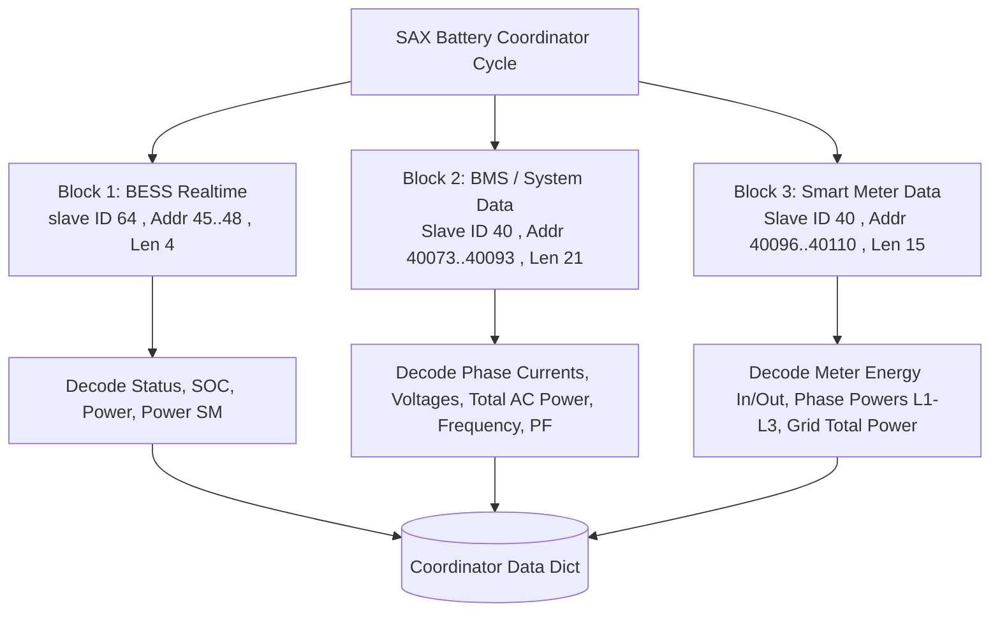
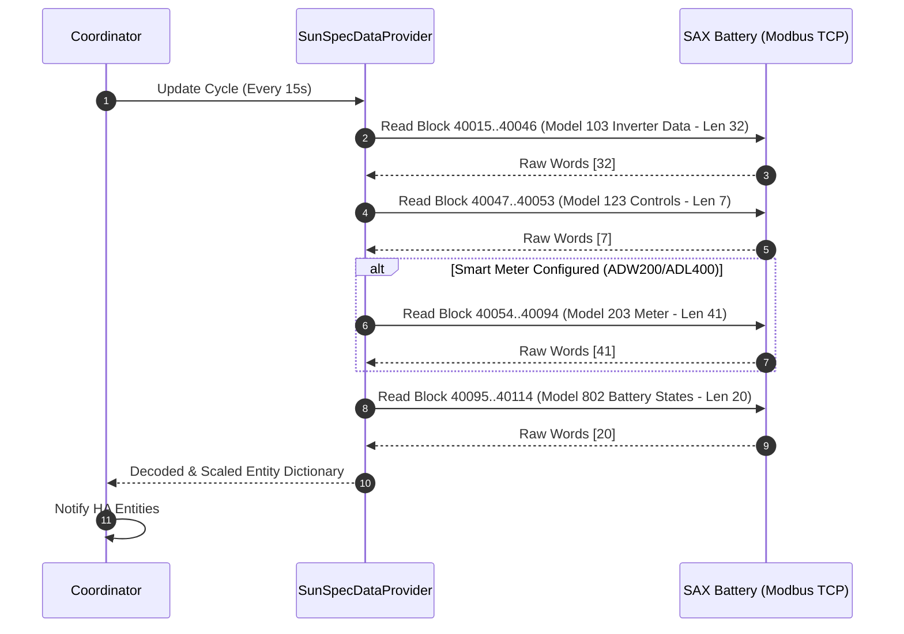
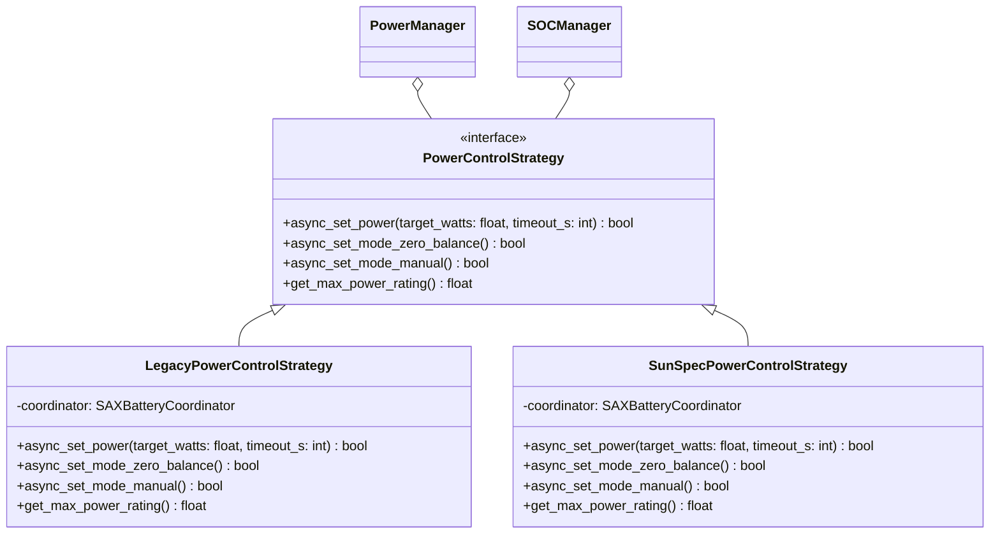
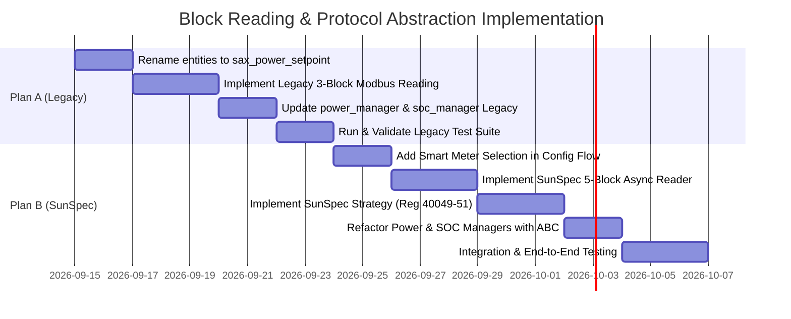

# Comprehensive Architectural Plan: Block-Based Register Reading & Protocol Abstraction

This document outlines the architectural and implementation plan divided into **Plan A (Legacy Protocol / Old Firmware)** and **Plan B (SunSpec Protocol / New Firmware)**. The primary objective is to transition from fragmented, single-register polling and legacy `device_batches` to deterministic **Modbus block reading**, while introducing a unified control abstraction for `power_manager.py` and `soc_manager.py`.

---

## 1. Executive Summary & Architectural Comparison

| Dimension | Plan A: Legacy Mode (Old FW) | Plan B: SunSpec Mode (New FW) |
| :--- | :--- | :--- |
| **Firmware Scope** | Master $\le 23.60$, Gateway $\le 0.54$ | Master $\ge 23.61$, Gateway $\ge 0.54$ |
| **Register Access** | R/O telemetry (45–48, 40073–40110), W/O controls (41–44) | Standardized SunSpec Blocks (40000–40114) with R/W Controls |
| **Reading Strategy** | 3 contiguous Modbus blocks (BESS, BMS, SmartMeter) | 5 standard SunSpec Model blocks (Common, Inverter, Controls, Meter, Battery) |
| **Control Mechanism** | Absolute Watts + Scale Factor (Regs 41, 42) | Relative Percentage ($-100\%$ to $+100\%$) + Mode Select (Regs 40049, 40050, 40051) |
| **Hardware Limits (43, 44)** | Missing on most units; handled via software supervisor | Controlled via SunSpec Mode switch (0-balancing vs. manual setpoint) |
| **State Caching** | Required in memory / RestoreEntity for write-only registers | **Obsolete**; registers are read back directly from hardware |
| **Smart Meter Support** | Auto-detected or fixed register mapping (40096–40110) | Configurable selection dialog: `ADW200`, `ADL400`, `Other`, `None` |

---

## 2. Plan A: Legacy Mode (Old FW) Enhancements

### 2.1 Entity Review, Nomenclature & Enhancements

#### Renaming & Deprecation Strategy

The previous implementation used `sax_nominal_power` and `sax_nominal_factor`, which were not fully validated in production environments and did not conform to Home Assistant naming best practices.

* **Renaming Actions:**
  * `number.sax_nominal_power` $\rightarrow$ `number.sax_power_setpoint`
  * `number.sax_nominal_factor` $\rightarrow$ `number.sax_power_setpoint_factor`
  * Corresponding internal constants in [custom_components/sax_battery/entity_keys.py](custom_components/sax_battery/entity_keys.py) and [custom_components/sax_battery/const_legacy.py](custom_components/sax_battery/const_legacy.py) will be renamed from `SAX_NOMINAL_POWER` / `SAX_NOMINAL_FACTOR` to `SAX_POWER_SETPOINT` / `SAX_POWER_SETPOINT_FACTOR`.
  * Update translation keys in [custom_components/sax_battery/strings.json](custom_components/sax_battery/strings.json) from `bms_nominal_power` to `bms_power_setpoint`.

#### Entity Configuration & Enhancements

* **Number Entities ([custom_components/sax_battery/number.py](custom_components/sax_battery/number.py)):**
  * `number.sax_power_setpoint`: Range $-4600\text{ W}$ to $+4600\text{ W}$ per battery (or clustered $\pm N \times 4600\text{ W}$ in UI), step $10\text{ W}$, default `0 W`.
  * `number.sax_power_setpoint_factor`: Allowed multiplier ($1000\text{ W}$ factor base), hidden from main dashboard into the Diagnostic category.
  * Atomic write grouping: Writes to `sax_power_setpoint` immediately package the factor and invoke `modbus_api.write_nominal_power()` as a single 2-register write transaction.

---

### 2.2 Register Block Reading Architecture

Currently, [custom_components/sax_battery/data_provider.py](custom_components/sax_battery/data_provider.py) in `LegacyDataProvider` reads each entity one by one via `async_read_value()`. This causes $25+$ individual Modbus requests per cycle, which creates high network latency and increases the risk of timeout.

We replace this with **3 discrete Modbus read blocks**:

#### Defined Legacy Blocks

1. **BESS Realtime Block (Slave ID: 64, Address: 45 to 48, Length: 4 registers):**
   * Reg 45: `SAX_STATUS` (uint16)
   * Reg 46: `SAX_SOC` (uint16)
   * Reg 47: `SAX_POWER` (int16, offset 16384)
   * Reg 48: `SAX_POWER_SM` (int16, offset 16384)
2. **BMS / System Telemetry Block (Slave ID: 40, Address: 40073 to 40093, Length: 21 registers):**
   * Regs 40073–40076: Phase currents sum, Current L1, Current L2, Current L3 ($0.01\text{ A}$)
   * Regs 40081–40083: Voltage L1, L2, L3 ($0.1\text{ V}$)
   * Reg 40085: AC Power Total ($10\text{ W}$)
   * Reg 40087: Grid Frequency ($0.1\text{ Hz}$)
   * Reg 40089: Apparent Power ($10\text{ VA}$)
   * Reg 40091: Reactive Power ($10\text{ var}$)
   * Reg 40093: Power Factor ($0.1$)
3. **Smart Meter Block (Slave ID: 40, Address: 40096 to 40110, Length: 15 registers - Master only):**
   * Regs 40096–40097: Energy Produced / Energy Consumed ($10\text{ kWh}$)
   * Reg 40099: Switching State
   * Regs 40100–40102: SmartMeter Current L1, L2, L3 ($0.01\text{ A}$)
   * Regs 40103–40105: SmartMeter Power L1, L2, L3 ($0.01\text{ kW}$)
   * Regs 40107–40109: SmartMeter Voltage L1, L2, L3 ($0.1\text{ V}$)
   * Reg 40110: SmartMeter Total Power ($1\text{ W}$)

---

### 2.3 Software-Based Power Control & Limits

Because hardware limit registers 43 (`SAX_MAX_DISCHARGE`) and 44 (`SAX_MAX_CHARGE`) are missing or read-only in older firmware:

1. **0-Balanced Power Charging (Zero Grid Import/Export):**
   * Implemented in [custom_components/sax_battery/power_manager.py](custom_components/sax_battery/power_manager.py).
   * Algorithm: Reads `SAX_SMARTMETER_TOTAL_POWER` (or external `power_sensor`) each cycle:
     $$\text{Target Power} = \text{Current Battery Power} - \text{Grid Power}$$
   * The calculated target is clamped to per-battery hardware ratings ($\pm 4600\text{ W}$) and written atomically to registers 41 & 42.
2. **Target SOC Limit Charging (e.g. Charge until 90% SOC):**
   * [custom_components/sax_battery/soc_manager.py](custom_components/sax_battery/soc_manager.py) monitors `SAX_COMBINED_SOC`.
   * When charging mode is active, power is commanded to the configured rate until $\text{SOC} \ge \text{Max SOC Charging}$ (`number.sax_bms_max_soc_for_charging`).
   * When reached, `power_manager` writes setpoint `0 W` and switches back to standby/balanced mode.

---

### 2.4 Legacy Test Plan & Validation Sequence

*All Legacy tests must execute and pass completely before SunSpec tests:*

1. **Unit Tests:**
   * Test block decode accuracy for BESS (45–48), BMS (40073–40093), and SM (40096–40110) in [tests/test_data_provider.py](tests/test_data_provider.py).
   * Test atomic writes to `number.sax_power_setpoint` and `number.sax_power_setpoint_factor` in [tests/test_number.py](tests/test_number.py).
   * Test SOC cutoff logic and power balancing in [tests/test_power_manager.py](tests/test_power_manager.py) and [tests/test_soc_manager.py](tests/test_soc_manager.py).
2. **Verification Suite:**
   * Execute `./scripts/run_tests.sh`
   * Execute `./scripts/run_ruff.sh`
   * Execute `./scripts/run_mypy.sh`

---

## 3. Plan B: SunSpec Mode (New FW) Architecture

### 3.1 SunSpec R/W Control Registers & Elimination of Local Caching

The new firmware provides 3 readable and writable control registers in SunSpec Model 123 (Immediate Controls):

| Register Address | Point Name | Type | Scaling / Unit | Description & Values |
| :--- | :--- | :--- | :--- | :--- |
| **40049** | `Conn_Win_Pct` | `int16` | $\text{SF} = \text{Reg } 40052$ (`%`) | **Power Setpoint**: $-100\%$ (max discharge) to $+100\%$ (max charge) |
| **40050** | `Conn_Win_Tgt` | `uint16` | Seconds (`s`) | **Timeout for Setpoint**: Default `60s`, maximum `300s` (fallback to default on timeout) |
| **40051** | `Mode` | `uint16` | Enum | **Power Control Mode**: • `0`: SmartMeter 0-balancing mode • `1`: Manual setpoint override |
| **40052** | `Conn_Win_Pct_SF` | `sunssf` | Scale Factor | Scale factor for setpoint percentage (typically `0`) |
| **40053** | `W_Max_Ref` | `uint16` | Watts (`W`) | Reference maximum power ($N_{\text{batteries}} \times 4600\text{ W}$) |

#### Elimination of Local State Caching

* Because registers 40049, 40050, and 40051 are readable Modbus registers, `SunSpecDataProvider` reads them in every cycle via the `battery_controls` block (40047–40053).
* Local caching via `RestoreNumber` and synthetic memory values is replaced by actual hardware feedback from the battery.

---

### 3.2 Block-Based Reading Architecture (Replacing `device_batches`)

In `coordinator.py`, `device_batches` and individual item queries are replaced by sequential SunSpec Model block polling:

---

### 3.3 Smart Meter Configuration Flow (`ADW200 | ADL400 | Other | None`)

To support systems with different smart meter hardware or without connected smart meters:

1. **Config Flow Step (`config_flow.py`):**
   * Add a select selector: `CONF_SM_TYPE` with options:
     * `adw200`: "ADW200 Smart Meter"
     * `adl400`: "ADL400 Smart Meter"
     * `other`: "Other Modbus Meter"
     * `none`: "No Smart Meter Connected"
2. **Behavioral Branching:**
   * When `none` is selected, `SunSpecDataProvider` skips reading Block 40054..40094 entirely, avoiding unnecessary bus traffic and Modbus exceptions.
   * `power_manager.py` uses external Home Assistant `power_sensor` for grid balancing when `none` is selected.

---

### 3.4 Library Evaluation: `pysunspec2` vs Native Async `pymodbus` Block Decoder

| Criteria | Option A: `pysunspec2` Library | Option B: Native Async `pymodbus` Block Decoder (*Recommended*) |
| :--- | :--- | :--- |
| **I/O Model** | **Synchronous / Blocking sockets**. Requires `asyncio.to_thread` or thread pools. | **100% Async / Non-blocking** on Home Assistant's event loop. |
| **Startup Discovery** | Scans all models dynamically across Modbus. Slow ($>500\text{ ms}$). | Instant start using fixed JSON model maps from `sax_models`. |
| **Dependencies** | Requires adding `pysunspec2` to `requirements.txt`. | Zero new dependencies; builds on existing `pymodbus`. |
| **Maintainability** | Dependent on external library release cycle and bug fixes. | Fully controlled inside the custom component codebase. |
| **Scale Factor Support** | Handled internally via model point definitions. | Handled cleanly in `sunspec_client.py` using `scale_factor_ref`. |

**Decision & Recommendation:**
Use **Option B (Native Async `pymodbus` Block Decoder)** leveraging the exact point schemas from `sax_models` (Models 1, 103, 123, 203, 802). This satisfies Home Assistant async guidelines without introducing blocking I/O or extra dependencies.

---

### 3.5 Unified Abstraction Layer for `power_manager.py` & `soc_manager.py`

To allow existing Home Assistant automations and entities (`number.sax_bms_max_charge`, `number.sax_bms_max_discharge`, `number.sax_bms_max_soc_for_charging`, `number.sax_bms_minimum_soc`) to work seamlessly across both Legacy and SunSpec hardware, we establish an abstraction layer:

#### Abstraction Details

1. **`PowerControlStrategy` Protocol:**
   * `async_set_power(target_watts: float, timeout_s: int = 60) -> bool`:
     * **Legacy**: Converts `target_watts` into `SAX_POWER_SETPOINT` (Reg 41) + `SAX_POWER_SETPOINT_FACTOR` (Reg 42).
     * **SunSpec**: Computes $\text{Percentage} = \frac{\text{target\_watts}}{W\_\text{Max\_Ref}} \times 100\%$, sets Reg 40051 (`Mode`) = `1`, writes Reg 40049 (`Conn_Win_Pct`) and Reg 40050 (`Conn_Win_Tgt`).
   * `async_set_mode_zero_balance() -> bool`:
     * **Legacy**: Runs internal software PID/balancing loop in `power_manager.py`.
     * **SunSpec**: Writes Reg 40051 (`Mode`) = `0` (Hardware autonomous SmartMeter 0-balancing).
2. **Unified UI Entities:**
   * `number.sax_bms_max_charge` & `number.sax_bms_max_discharge`: Directly bound to the strategy's target power boundaries.
   * `number.sax_bms_max_soc_for_charging` & `number.sax_bms_minimum_soc`: Monitored by `SOCManager`. When SOC bounds are hit, `SOCManager` calls `async_set_power(0)` or toggles `async_set_mode_zero_balance()`.

---

## 4. Implementation Roadmap & Milestones

### Step 1: Legacy Entity Renaming & Block Reader (Plan A)

* Update `entity_keys.py`, `const_legacy.py`, and `strings.json` for `sax_power_setpoint` and `sax_power_setpoint_factor`.

* Implement `LegacyDataProvider` block reads for BESS (45–48), BMS (40073–40093), and SM (40096–40110).
* Run all unit and integration tests via `run_tests.sh`.

### Step 2: Config Flow Smart Meter Enhancements (Plan B)

* Add `CONF_SM_TYPE` options (`adw200`, `adl400`, `other`, `none`) in `config_flow.py`.

* Conditionalize Smart Meter block reads based on selection.

### Step 3: SunSpec Block Reading & Strategy Implementation (Plan B)

* Streamline `sunspec_client.py` and `data_provider.py` to read SunSpec Models 103, 123, 203, 802.

* Implement `SunSpecPowerControlStrategy` writing to registers 40049 (`Conn_Win_Pct`), 40050 (`Conn_Win_Tgt`), and 40051 (`Mode`).
* Remove local value caching for SunSpec control numbers since values are read directly from hardware block 40047–40053.

### Step 4: Verification & Quality Assurance

* Verify full test suite coverage: `pytest tests/`

* Verify linting and typing: `pre-commit run ruff-check --all-files` and `mypy` static type analysis.

Created 4 todos
